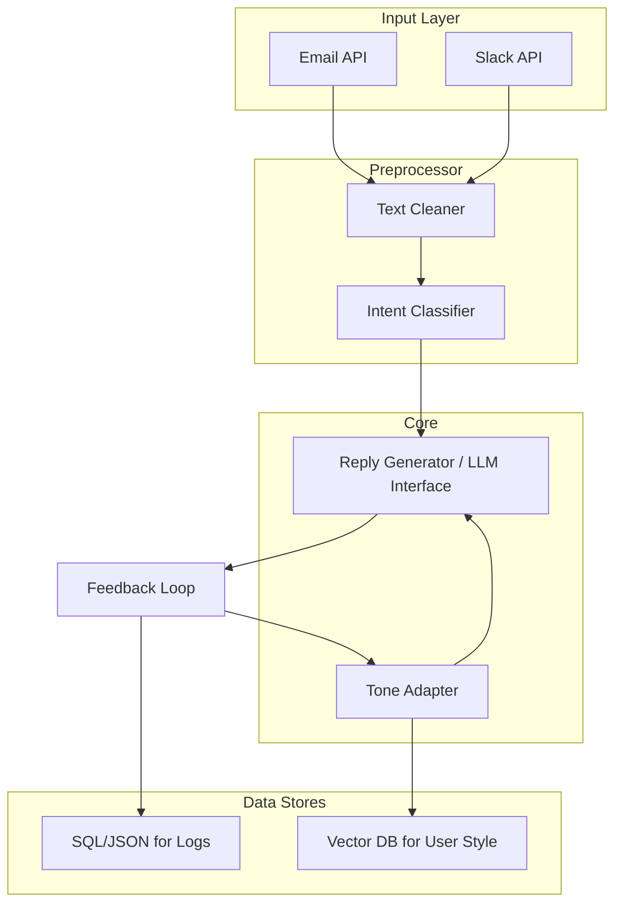

# AI Auto-Reply System

This document outlines the architecture, setup, and initial prototype for an AI auto-reply system.

## Day 1: Architecture, Setup & Planning

### 📊 Architecture Diagram



### 🧩 Tech Stack Recommendation

*   **Email access:** Gmail API (OAuth 2.0, `google-auth`, `google-api-python-client`)
*   **Slack access:** Slack SDK (`slack_bolt` or `slack_sdk`)
*   **Database:** ChromaDB (for embedding tone learning) + SQLite for message storage
*   **Model:** Anthropic Claude (for response generation)
*   **Framework:** Python (FastAPI backend)
*   **Vector embedding:** `sentence-transformers`
*   **Frontend (later):** Next.js or React

### 💻 Setup Guide

1.  **Create the project directory:**
    ```bash
    mkdir ai-autoreply
    cd ai-autoreply
    ```

2.  **Create and activate a virtual environment:**
    ```bash
    python -m venv venv
    # On Windows
    venv\Scripts\activate
    # On macOS/Linux
    source venv/bin/activate
    ```

3.  **Install dependencies:**
    ```bash
    pip install -r requirements.txt
    ```

4.  **API Key Setup:**
    Create a `.env` file in the root of the project and add your API keys:
    ```
    ANTHROPIC_API_KEY="your-anthropic-api-key"
    SLACK_BOT_TOKEN="your-slack-bot-token"
    SLACK_SIGNING_SECRET="your-slack-signing-secret"
    USE_MOCK_REPLY_GENERATOR=True
    ```
    By default, the application uses a mock reply generator to avoid costs. To use the real Anthropic Claude API, change `USE_MOCK_REPLY_GENERATOR` to `False`.

### 📁 Folder Structure

```
ai-autoreply/
├── backend/
│   ├── main.py
│   ├── intent_classifier.py
│   ├── reply_generator.py
│   └── tone_adapter.py
├── data/
│   ├── logs/
│   │   └── day2_demo.json
│   └── samples/
│       └── messages.txt
├── models/
├── utils/
├── .env
├── requirements.txt
└── README.md
```

## Day 2: Prototype & Demo Flow

### 🧠 Prototype Core Logic

The core logic is implemented in `backend/main.py`. It reads sample messages, classifies their intent, generates a reply, and logs the results.

### 🧩 Intent Classifier Example

The intent classifier in `backend/intent_classifier.py` uses a simple keyword-based approach to categorize messages.

### 🧠 Reply Generator Example

The reply generator in `backend/reply_generator.py` can be toggled between a mock and a real Anthropic Claude API call using the `USE_MOCK_REPLY_GENERATOR` variable in the `.env` file.

### 📜 Example Output

```
Input: "Hey, can we schedule a quick meeting tomorrow to go over the report?"
Intent: meeting_request
AI Reply: Sure! I’d be happy to schedule a quick meeting. How about tomorrow afternoon?

Input: "Thanks a lot for the help with the documents!"
Intent: thank_you
AI Reply: You're very welcome! Glad I could assist.
```

### 💡 Next Steps

*   Connect to Gmail + Slack APIs.
*   Add tone-learning from my previous replies.
*   Create a dashboard for human approval before sending.